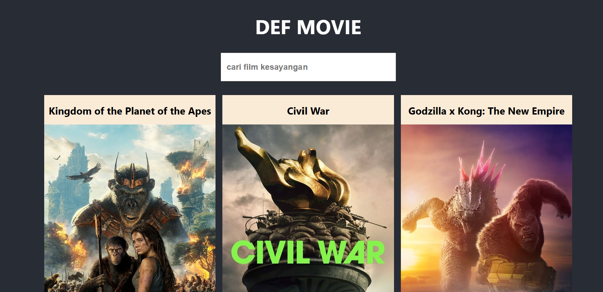

# Def Movie
Sebuah halaman website untuk menampilkan film - film populer saat ini menggunakan api `The Movie Database API`

## Daftar Isi
- [Tumpukan Teknologi](#tumpukan-teknologi)
- [API](#api)
- [Fitur](#fitur)
- [Beberapa Dokumentasi Halaman](#beberapa-dokumentasi-halaman)
- [Cara Instalasi](#cara-instalasi)

## Tumpukan Teknologi
### Frontend
- **ReactJS**: Perpustakaan UI untuk membangun antarmuka pengguna
- **Axios**: Library HTTP client berbasis Promise untuk melakukan request ke API

## API
Proyek ini menggunakan API untuk mendapatkan data dari `The Movie Database API`

## Fitur
- Menampilkan film yang sedang populer
- Mencari film yang ingin dicari

## Beberapa Dokumentasi Halaman
##### 1. Halaman Awal


##### 2. Halaman Informasi Film


## Cara Instalasi

```bash
# Clone repository ini
git clone https://github.com/defrijay/def-movie.git

# Masuk ke direktori proyek
cd def-movie

# Instal dependensi
npm install

# Instal dependensi axios
npm i axios

# Jalankan server kodenya secara live
npm start --watch

# Buka url servernya
 http://localhost:3000
